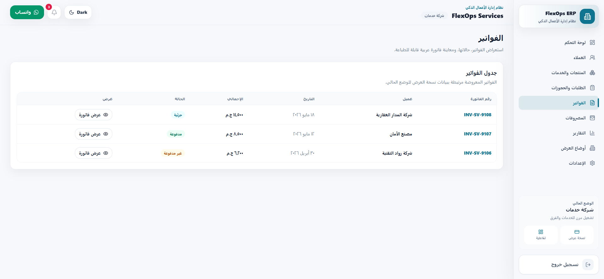
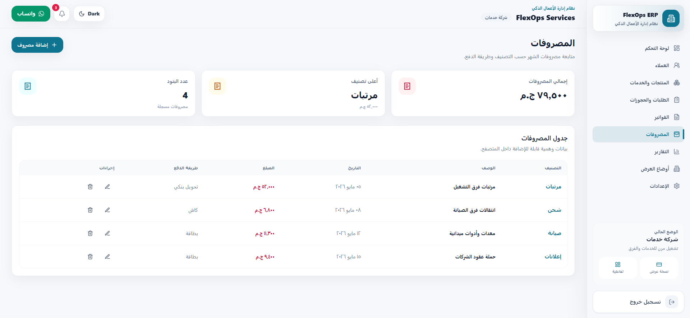
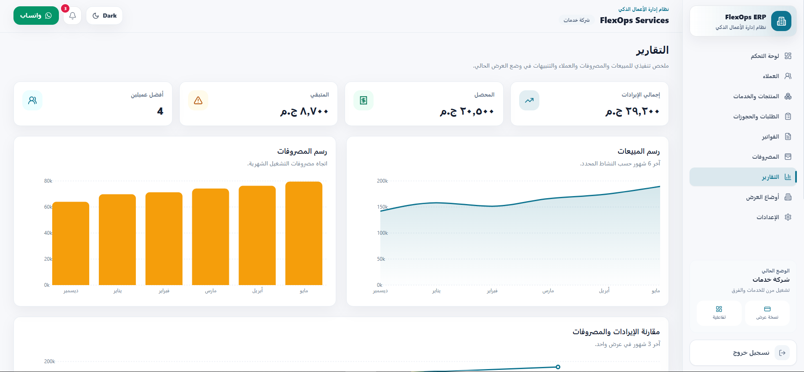
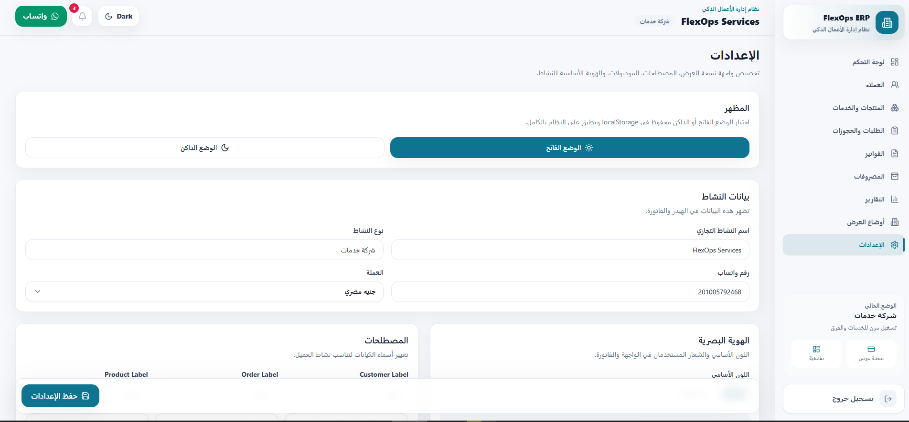

# FlexOps ERP Demo

واجهة ERP عربية تجريبية قابلة للتخصيص لأي نشاط تجاري مثل عيادة، جيم، مطعم، محل، أو شركة خدمات.

المشروع **Front-End Only Demo** للعرض على العملاء أو إضافته في البورتفوليو. لا يحتوي على Backend أو Auth حقيقي أو API حقيقي.

## صور من المشروع

| شاشة البدء | لوحة التحكم |
|---|---|
|  |  |


| المنتجات والخدمات | الطلبات والحجوزات |
|---|---|
|  |  |

| الفواتير | المصروفات |
|---|---|
|  |  |

| التقارير | الإعدادات |
|---|---|
|  |  |

| أوضاع العرض |
|---|
|  |

## المميزات

- واجهة عربية RTL بالكامل.
- Dashboard احترافي بإحصائيات ورسوم بيانية.
- Dark / Light mode محفوظ في `localStorage`.
- أوضاع عرض جاهزة: عيادة، جيم، مطعم، محل تجاري، شركة خدمات.
- إدارة العملاء مع إضافة، تعديل، حذف، وتحديد متعدد.
- إدارة المنتجات والخدمات مع إضافة، تعديل، وحذف.
- إدارة الطلبات والحجوزات مع بحث، فلترة، وتغيير الحالة.
- فواتير عربية قابلة للمعاينة والطباعة.
- مصروفات مع ملخص شهري وإضافة/تعديل/حذف.
- تقارير وتنبيهات وإشعارات مقروءة/غير مقروءة.
- إعدادات لتخصيص اسم النشاط، اللون، العملة، المصطلحات، والموديولات.
- Responsive للموبايل والتابلت والديسكتوب.

## التقنيات

- React
- Vite
- TypeScript
- Tailwind CSS
- React Router DOM
- Zustand
- Recharts
- Lucide React
- localStorage

## التشغيل

```bash
npm install
npm run dev
```

ثم افتح الرابط الذي يظهر في التيرمنال، غالبًا:

```bash
http://localhost:5173
```

## بيانات الدخول التجريبية

```txt
Email: demo@flexops.com
Password: 123456
```

## ملاحظات مهمة

- لا يوجد Backend.
- لا يوجد Supabase.
- لا يوجد Firebase.
- لا يوجد Auth حقيقي.
- لا توجد بيانات حقيقية.
- كل البيانات Mock Data.
- بعض التفاعلات محفوظة في `localStorage`.
 
